# 0. 纯净系统的利与弊

凡事皆有利弊，在决定是否要安装一个纯净的操作系统之前，我们先来看一下纯净的系统有哪些优势和劣势。

固然，经过加工处理过的系统会绑定许多流氓软件甚至阉割掉电脑厂商认为我们所不需要的功能。但是不得不承认这种非纯净的系统在易用性上远远胜出。

纯净版的系统的优劣都在“纯净”这两个字上。

因为纯净，所以没有流氓软件的骚扰与拖累。

也是因为纯净，可能会缺少软件所依靠的运行环境。

这就要求我们在安装好纯净的操作系统之后，必须首先更新操作系统、安装驱动以及安装许多语言（这里指编程语言）的运行环境和编译器。

如果你**对折腾饱含热情**或者**对自己的计算机水平略有信心**的话，自己动手重做系统将是一个非常不错的选择。

但也请注意，如果您对电脑不甚了解的话，请务必求助专业人士来帮你完成下面的工作。~~当然 Charlie 无法保证“专业人士”会给你一个什么样的结果……~~

---

# 1. 准备工作

## 1.1 备份文件

注意！Charlie 推荐将数据和文件被分到可移动硬盘或者 U 盘。这样最省心！

{: .notice--info}

> **数据**就是**金钱**！
>
> **数据**就是**生命**！
>
> **数据**就是**一切**！

数据是你再用相同的时间也不一定换得回来的宝贵资源，因此在重做系统之前一定一定要备份数据。

需要备份的内容除了我们自己保存的各类数据和文件之外，一定要记得检查“文档”这个文件夹中的内容。

几乎所有的软件都会把用户数据储存在这个文件夹中，包括且不仅限于我们日常使用的 QQ、微信和各类游戏等软件。在我们使用电脑的过程中，这些用户文件是持续产生且储存在 C 盘的这个目录下的，这也是我们 C 盘越用越满，电脑越用越卡的原因。

打开`我的电脑`即可以看到这个文件夹，如下所示：

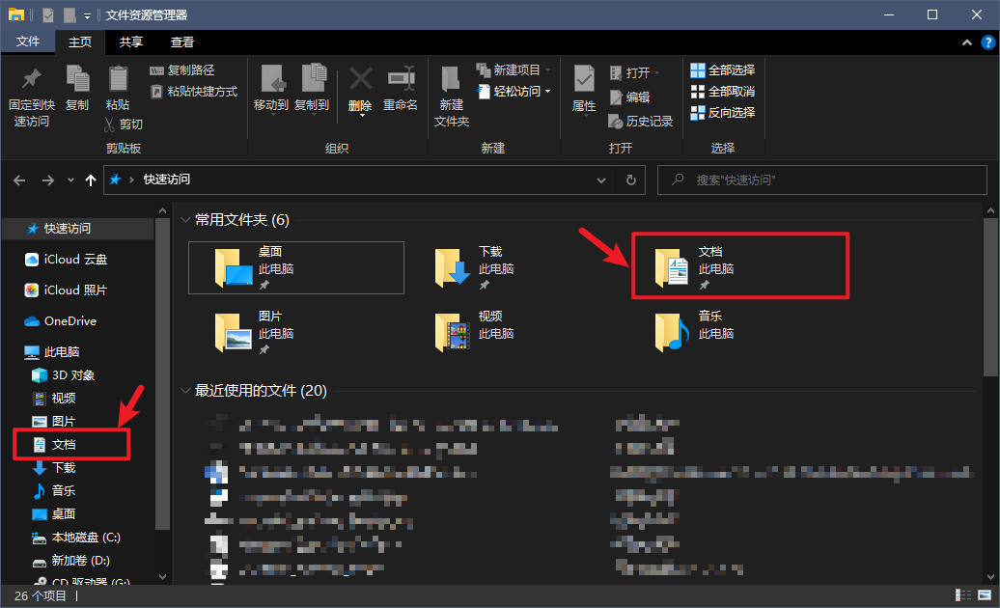

备份数据有两种模式：只格式化系统盘 或者 格式化整个电脑。容我进行一下简单介绍:

* 电脑上除了 C 盘还至少有其他盘（这样操作其实很不省心）

> 如果你的电脑上电脑上除了 C 盘还有其他盘，那么你可以把数据备份到除了 C 盘以外的其他硬盘上，如到 D 盘。这里面有一个小问题，就是是否要保留原本留在D盘里面的其他数据。
>
> 其中的文件无非是分为两类，数据和软件。
>
> 数据、视频、图片、文档等文件是否需要保留大家根据需要决定就可以。但是软件部分 Charlie 强烈建议不要保留。
>
> 一方面由于重新做了操作系统之后，注册表和配置文件等关键信息可能会丢失，另一方面软件这个东西如果不是正常安装的话，鬼知道会出现什么 BUG。
>
> 这种情况下可以只格式化 C 盘，不对其他盘进行操作。

* 电脑只有一个 C 盘（省心）

> 如果电脑上只有这一个盘的话，就必须使用其他的 U 盘或者其他移动硬盘来备份数据了，这部分不再赘述。

## 1.2 下载操作系统

随便百度一下“Windows 10 下载”就会有很多第三方的网站结果出来，依照 Charlie 的经验，这些网站上面挂的操作系统镜像都是“豪华版”。

这种“豪华版”的镜像通常都绑定了许多的流氓软件，甚至有病毒木马或者后门。

> 官网是下载软件的最佳路径。

微软一直以来都在自己的网站上挂在了纯净系统的[下载连接](https://www.microsoft.com/zh-cn/software-download/windows10)（无法跳转请访问：https://www.microsoft.com/zh-cn/software-download/windows10）。

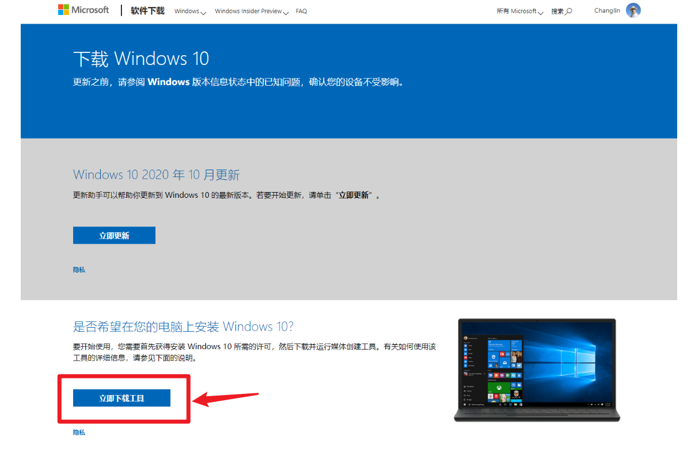

此处我们所下载的并不是完整的 Windows 10 操作系统，而是操作系统的下载器`MediaCreationTool20H2`。（根据下载的 Windows 版本不同，最后的4位版本号可能会有出入）

## 1.3 安装到U盘

此处 Charlie 并不准备使用 PE 去安装系统，因为某些 PE 也会在未经允许的情况下安装流氓软件。因此我们使用微软官方的安装工具制作系统安装盘。

首先，准备一个不小于 8G 的 U 盘，连接到电脑上，确认 U 盘可以被电脑识别到。

> 别担心，装完系统之后 U 盘还可以继续使用

制作系统安装盘的操作会格式化 U 盘，请注意备份重要文件。

{: .notice--warning}

打开`MediaCreationTool`，接受许可协议。

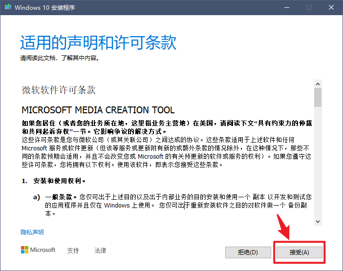

选择“为另一台电脑创建安装介质（U 盘、DVD 或 ISO 文件）”。

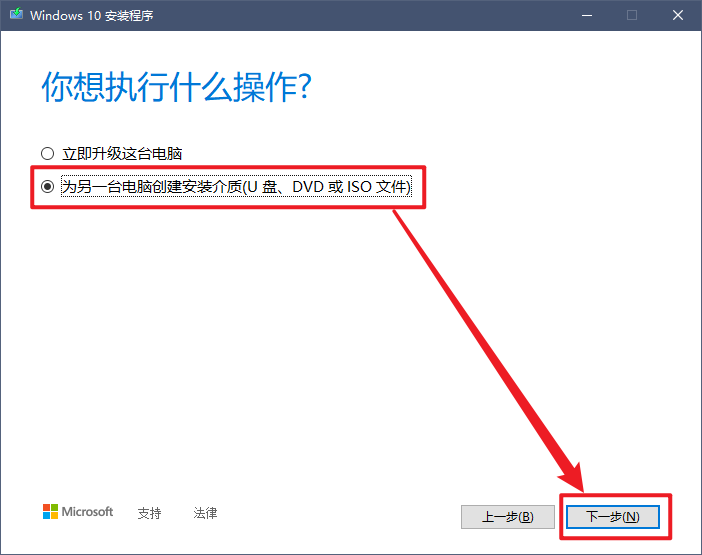

默认，下一步。

选择“U 盘”。

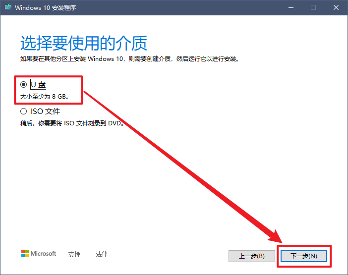

选择你的 U 盘。如果电脑上连接了多个U盘无法确认的话，可以移除其他的 U 盘然后点击“刷新驱动器列表”。

随后，`MediaCreationTool`会自动将你的 U 盘只作为系统安装盘。此时请耐心等待，根据实际的网络情况，等待时间会从 20分钟 - 2小时 不等。

如果你看到了如下界面，那么你的装机盘已经制作完毕了，开始装系统吧！

---

# 2. 安装系统

## 2.1 安装

将 U 盘插到电脑上，重启电脑。顺利的话，电脑将自动重启进入如下界面：

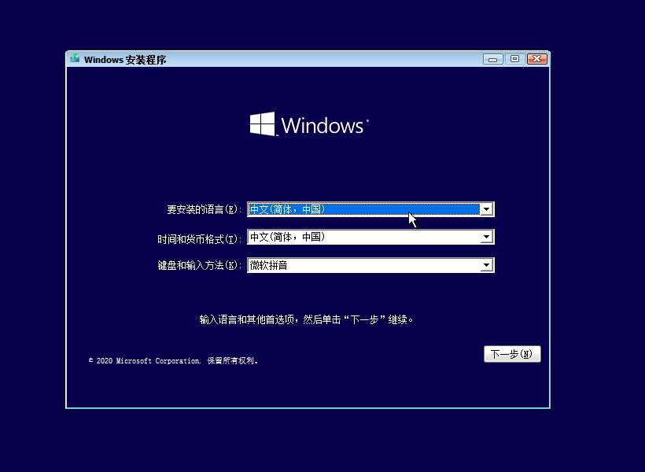

> 如果没能自动进入到这个界面的话，重新启动电脑。在电脑启动的过程中注意屏幕的提示。
>
> 如 Charlie 手边的是一台 Intel NUC5i7RYH。在启动时会显示如下界面：
>
> 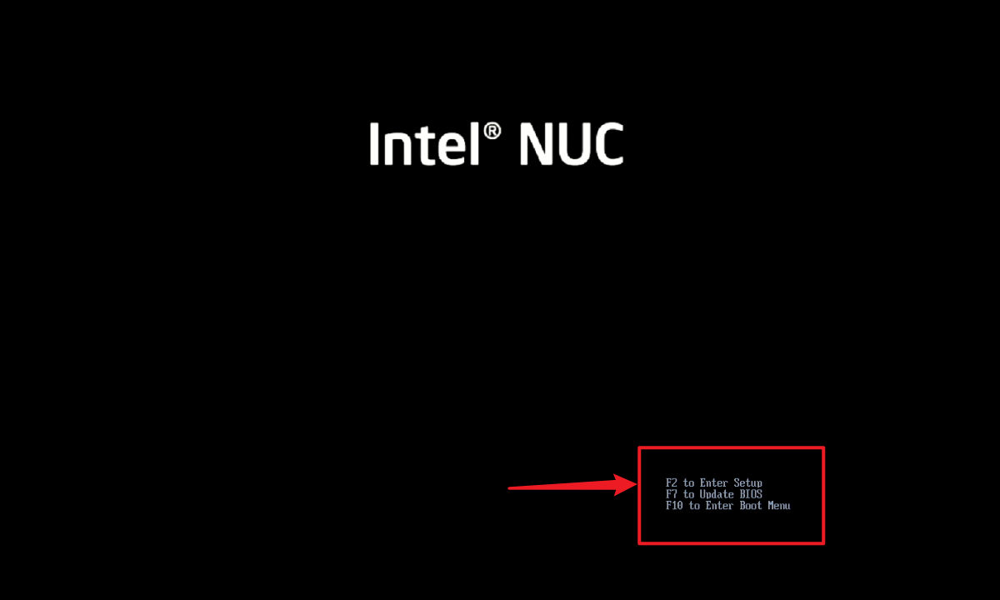
>
> 其中最后一行提示`F10 to Enter Boot Menu`，所以应该在此时尽快按`F10`启动 BootManager。
>
> 因为电脑的主板型号不同，具体按键也不尽相同，基本的逻辑就是找一找看通过什么按键可以进入到`Boot Menu`或者`Boot Manager`。常见的按键包括但不仅限于`F12`、`F1`、`F2`和`F10`，按照概率排序。
>
> 随后在 Boot Manager 中选择以“USB”开头的选项：
>
> 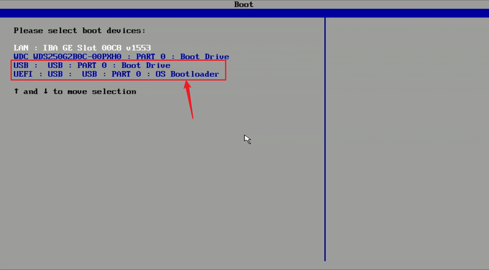
>
> 按回车即可进入到开始介绍的界面。

一切默认选择，直接点击下一步：

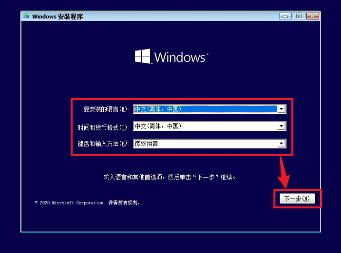

现在安装：

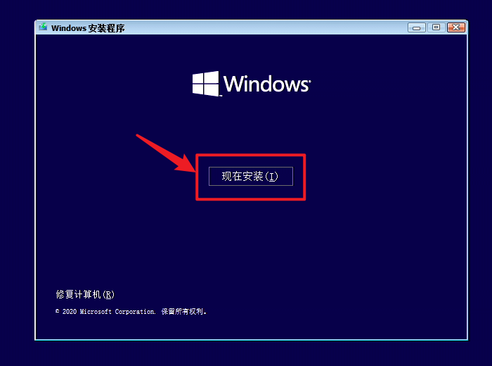

选择“我没有产品密钥”：

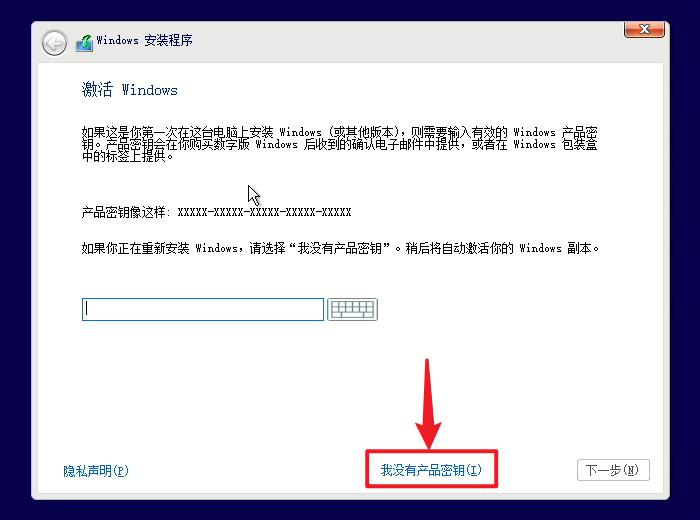

选择“Windows 10 专业版”，点击“确定”：

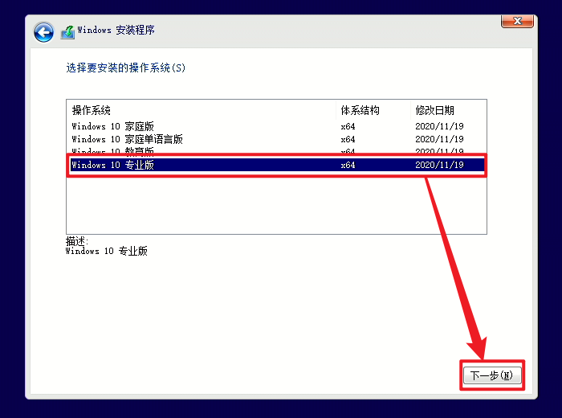

接受许可条款，点击“下一步”：

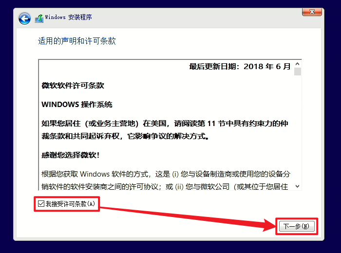

选择“自定义：仅安装 Windows (高级) (C)”：

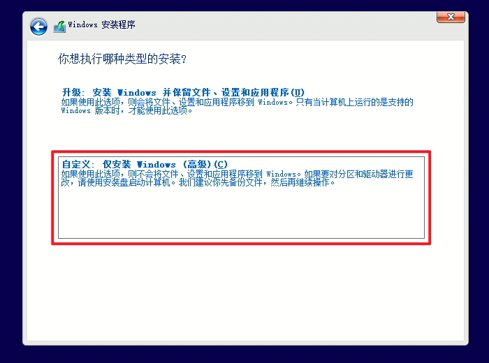

选择要安装的驱动器，这一步比较复杂。

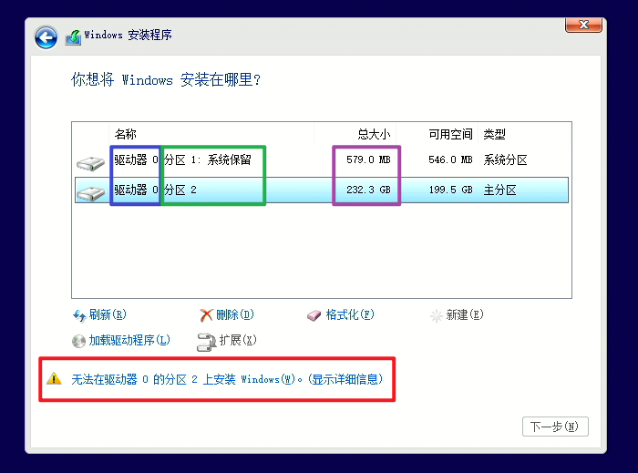

首先，我们需要选择正确的驱动器分区，即我们平时所说的 `C 盘`、`D 盘`、`E 盘`。

> 蓝色：代表物理硬盘，指电脑中实际安装了几个硬盘。
>
> 绿色：代表硬盘分区，除了`C 盘`、`D 盘`、`E 盘`外还会有系统引导分区和恢复分区等。
>
> 紫色：分区盘的容量。

对于初学者来说貌似很难去判断应该选择哪一个，那么我们使用一个简单一点的方法。

* 电脑上除了 C 盘还至少有其他盘

> 注意上图中紫色标记的数值，根据硬盘容量找到哪个是你的 C 盘分区。只删除这一个分区。

* 电脑只有一个 C 盘

> 重复下图的步骤，依次删除全部的分区。

注意！如果您将数据备份到了除了 C 盘的其他硬盘上，一定不要删除错误，否则全部数据都将丢失。

{: .notice--warning}

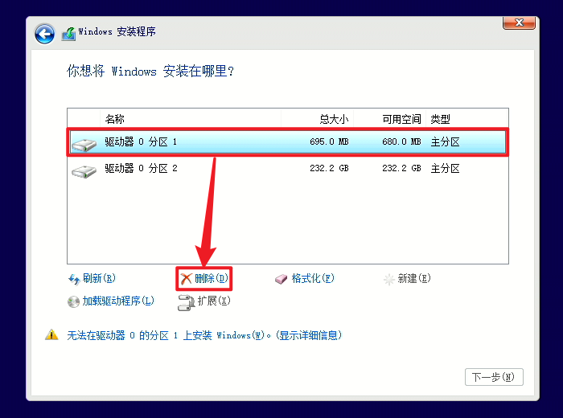

随后在列表中选中“驱动器 x 未分配的空间”，点击下一步（列表中也可能有其他分区）：

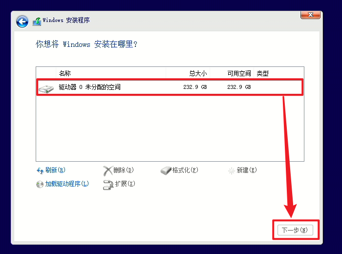

随后，系统将会自动安装，安装完毕后系统会自动重启：

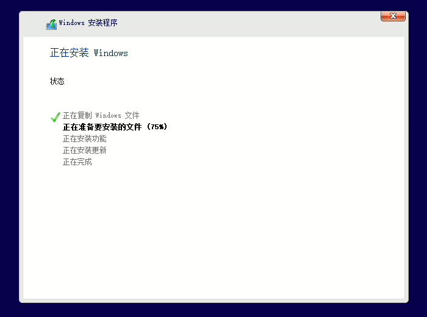

电脑重启后，拔下 U 盘即可。重启的过程实际上是第一次启动系统，过程会有些漫长，我们耐心等待。

## 2.2 初始化

重启后我们就可以开始初始化我们的新操作系统了。

选择“中国”，点击“是”：

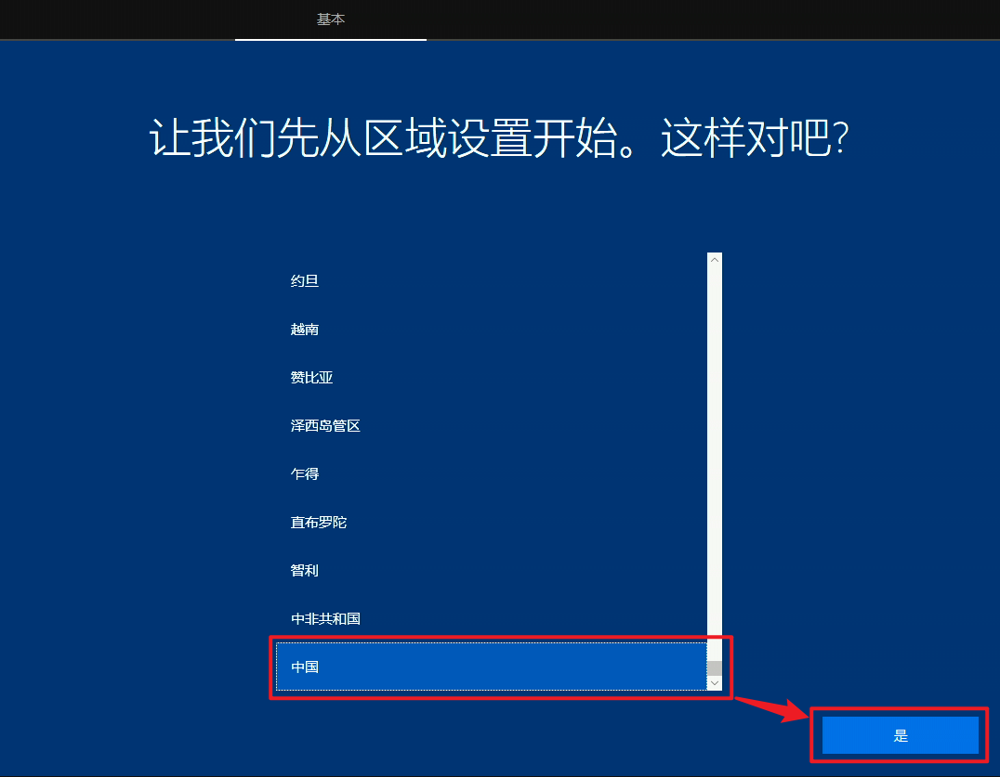

选择“微软拼音”，点击“是”：

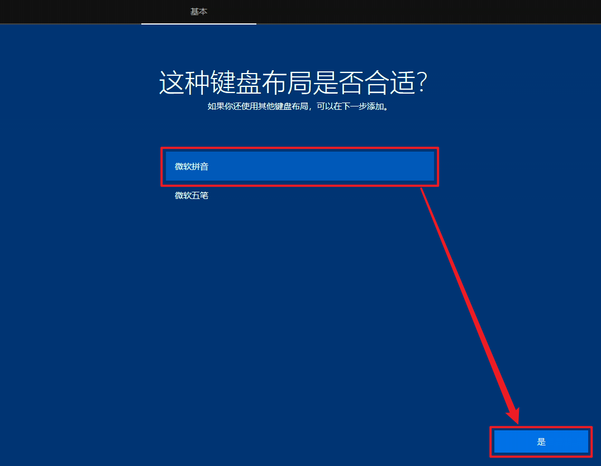

点击“跳过”：

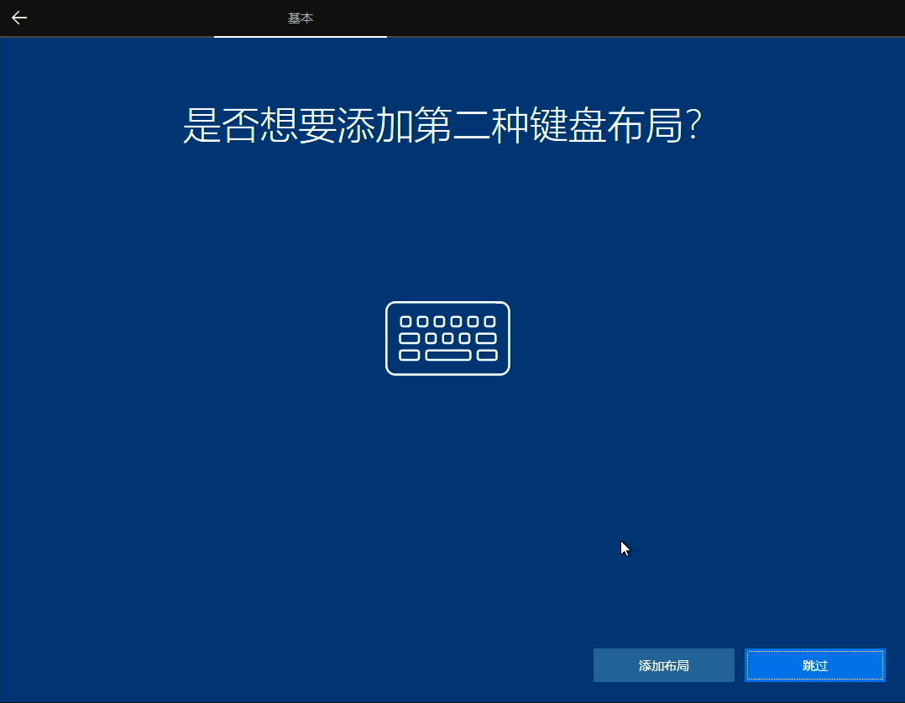

---

# 3. 补全驱动和运行环境

## 3.1 激活系统

## 3.2 更新系统

## 3.3 安装驱动

## 3.4 安装运行环境

---

# 4. 说点其他

## 4.1 格式化 U 盘

## 4.2 分盘

## 4.3 如何正确下载软件

---

以上。
