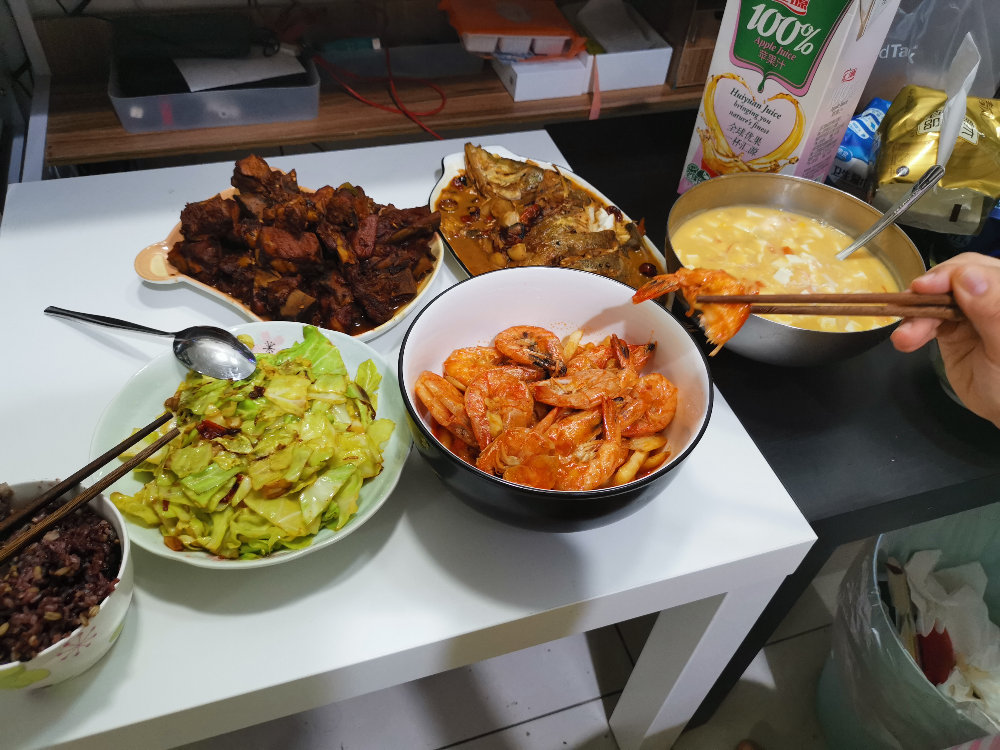

---
​---
title: "辛丑牛年 - 年夜饭"
excerpt: "第一次在北京过年，也是第一次自己主持一顿年夜饭。两个人忙里忙外的四菜一汤，手忙脚乱地没来得及拍制作过程。具体的菜谱会在以后补上。"
read_time: false
header:
  overlay_image: /assets/images/recipes-2021_nianyefan-header.png
  overlay_filter: 0.5
  teaser: /assets/images/recipes-2021_nianyefan-teaster.png
categories:
  - Recipe
classes: wide
toc: false # 右侧页内导航
comments: true

---

**Charlie 在这里祝各位牛年大吉，和乐安康！**

晒下年夜饭吧：

- 红烧排骨

- 红焖桂鱼

- 油焖薯条虾

- 火爆大头菜

- 蟹黄豆花汤

- 莲子八宝饭

  ---

  P.S. 排骨和鱼真的是第二顿更香！

  嗝~~~